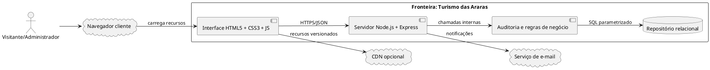
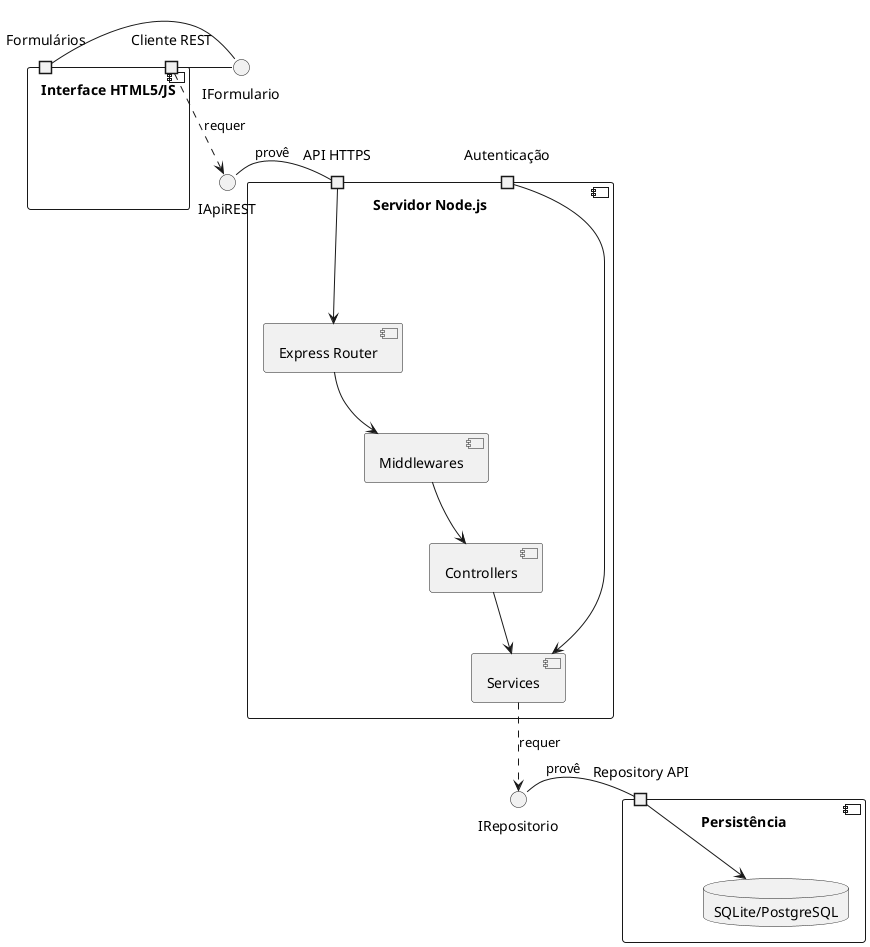
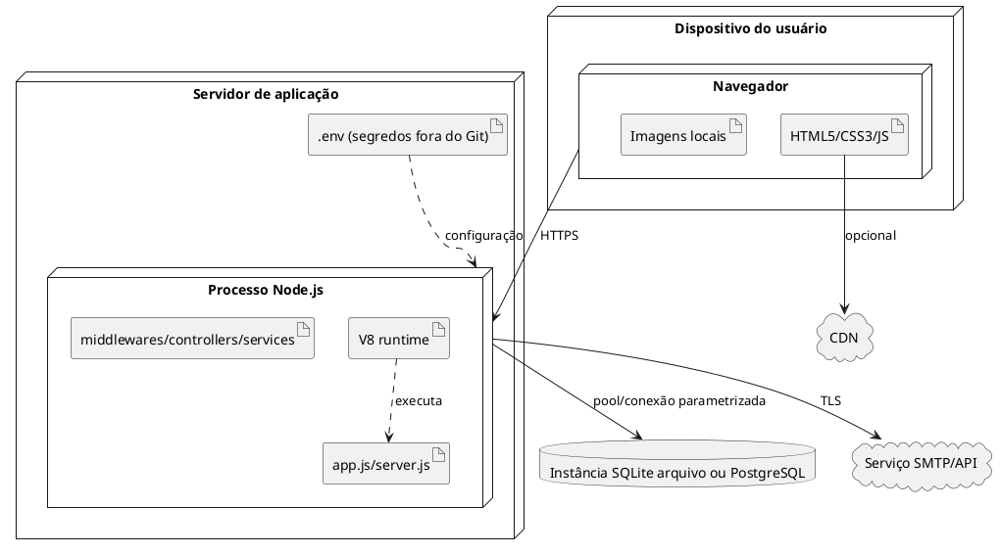
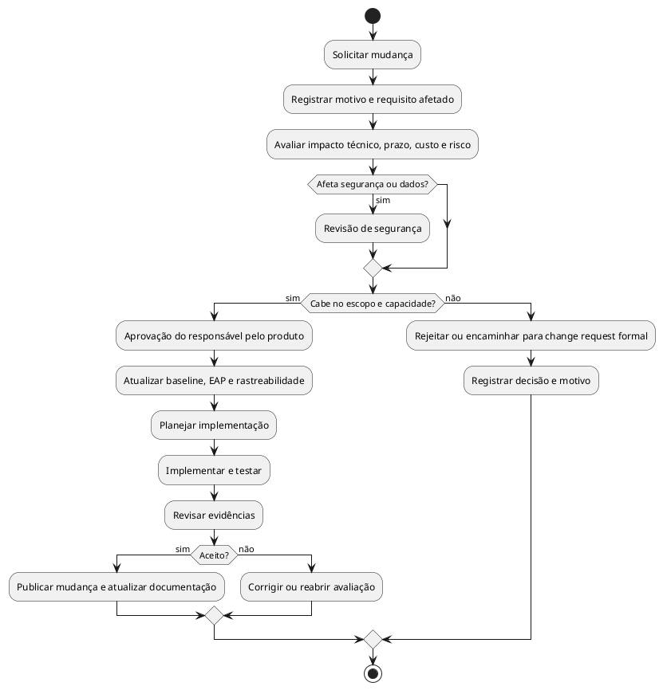

# Escopo do Projeto

**Produto:** Turismo das Araras  
**Versão:** 1.0  
**Referenciais:** PMBOK 7ª edição, UML 2.5.1, ISO/IEC/IEEE 29148:2018

## 1. Justificativa de engenharia

O portal atual possui páginas HTML de catálogo turístico, imagens locais e fluxos visuais de login/cadastro. A evolução para uma solução Node.js + HTML5 mantém o baixo atrito do frontend, centraliza regras no servidor, permite validação consistente e cria uma base rastreável para publicação de atrativos e atendimento. A separação entre interface, runtime e persistência reduz acoplamento, possibilita SQLite em ambiente simples e PostgreSQL em produção e fornece uma fronteira clara para segurança e governança.

### 1.1 Objetivos SMART

| Objetivo | Especificação mensurável |
|---|---|
| Catálogo | Disponibilizar 100% dos atrativos aprovados em consulta pública paginada até o fim da primeira entrega funcional. |
| Atendimento | Registrar 100% dos formulários válidos com identificador, status e data UTC, sem duplicação por reenvio idempotente, na homologação. |
| Segurança | Alcançar 100% de cobertura de testes dos fluxos de autenticação, autorização, XSS e SQL Injection antes da publicação. |
| Desempenho | Manter p95 inferior a 500 ms em leituras de catálogo sob a carga nominal definida pelo teste de aceite. |
| Governança | Aprovar toda mudança de escopo por registro de impacto, responsável, decisão e versão antes de desenvolvimento. |

## 2. Fronteira do sistema e contexto

Dentro da fronteira ficam a interface HTML5/JS, a API Express, regras de negócio, autenticação, auditoria e o adaptador de persistência. Navegador, CDN, serviço de e-mail e infraestrutura de banco são externos, ainda que integrados por contratos.

## 3. Escopo do produto por módulos e entregáveis físicos

| Módulo | Responsabilidade | Entregáveis físicos |
|---|---|---|
| Interface pública | Catálogo, detalhes, formulário, feedback | Arquivos `.html` existentes e novos scripts JS ES6+, CSS, assets locais |
| Autenticação | Cadastro, login, logout, sessão/token | `routes/auth.routes.js`, `controllers/auth.controller.js`, `services/auth.service.js`, middleware JWT |
| Catálogo | CRUD de atrativos e publicação | `routes/atrativos.routes.js`, controller, service, repository e validações |
| Atendimento | Solicitação e alteração de status | `routes/solicitacoes.routes.js`, controller, service, transações e DTOs |
| Administração | Listagens, confirmação dupla, auditoria | telas administrativas, RBAC, rotas protegidas, componentes de modal |
| Persistência | Schema, migrações, índices e pool | `db/migrations/*.sql`, `db/seed.*`, `repositories/*.js`, configuração SQLite/PostgreSQL |
| Plataforma | Inicialização, saúde e configuração | `server.js`, `app.js`, `.env.example`, logger, tratamento de erros e graceful shutdown |
| Qualidade | Contratos, testes e rastreabilidade | testes unitários/integrados/E2E, especificação OpenAPI e documentação Markdown |

Os arquivos de conteúdo turístico e imagens que já existem permanecem inalterados nesta atividade. A implementação futura pode referenciá-los ou migrar seus dados, mas migração não é presumida como concluída.

## 4. Diagrama de componentes UML 2.5.1

Portas públicas são HTTPS/JSON e autenticação; portas internas são interfaces de serviço e repositório. A interface não conhece SQL e a persistência não decide regras de autorização.

## 5. Diagrama de implantação

## 6. EAP/WBS e dicionário de entregáveis

### 6.1 Estrutura hierárquica

1. **Turismo das Araras**
   1.1 **Gestão e governança**
   1.1.1 Termo de abertura e objetivos  
   1.1.2 Registro de riscos, decisões e mudanças  
   1.1.3 Revisões de arquitetura e aceite
   1.2 **Experiência pública**
   1.2.1 Catálogo e busca  
   1.2.2 Detalhes de atrativos  
   1.2.3 Formulário e feedback acessível
   1.3 **Identidade e acesso**
   1.3.1 Cadastro  
   1.3.2 Login, JWT e logout  
   1.3.3 RBAC e proteção de rotas
   1.4 **Operação administrativa**
   1.4.1 CRUD de atrativos  
   1.4.2 Fila de solicitações  
   1.4.3 Transições de status  
   1.4.4 Exclusão segura e auditoria
   1.5 **Plataforma**
   1.5.1 API Express e contratos  
   1.5.2 Banco, migrações e índices  
   1.5.3 Observabilidade, saúde e backup
   1.6 **Qualidade e entrega**
   1.6.1 Testes unitários/integrados/E2E  
   1.6.2 Testes de segurança e carga  
   1.6.3 Documentação e publicação

### 6.2 Dicionário de entregáveis

| Código | Entregável | Critério de conclusão |
|---|---|---|
| E-01 | Catálogo público | Lista, filtro, detalhe e estados vazios testados |
| E-02 | Formulário público | Validação client/server, sanitização e Toast acessível |
| E-03 | Autenticação | Hash seguro, JWT/cookie, expiração e RBAC testados |
| E-04 | API REST | Rotas, payloads, erros e status documentados |
| E-05 | Banco | Migrações idempotentes, constraints, índices e backup de teste |
| E-06 | Operação | Status, confirmação dupla e auditoria implementados |
| E-07 | Qualidade | Evidências de testes e relatório de riscos aprovado |

## 7. Limites explícitos

### 7.1 Dentro do escopo (In-Scope)

- Catálogo público de atrativos turísticos, busca e detalhes.
- Cadastro, autenticação, logout e autorização por papel.
- Formulário público com validação, sanitização e registro.
- Painel administrativo para manutenção e publicação de atrativos.
- Consulta de solicitações, alteração controlada de status e auditoria.
- Exclusão lógica ou física conforme política aprovada, sempre com confirmação dupla.
- API REST JSON, Node.js/Express, SQLite/PostgreSQL e Prepared Statements.
- HTML5 semântico, JavaScript ES6+, acessibilidade, testes e documentação técnica.
- Configuração por ambiente, logs, health check, migrações e plano de backup.

### 7.2 Fora do escopo (Out-of-Scope)

- Aplicativo nativo iOS/Android.
- Reserva, pagamento, emissão de ingresso ou integração com operadoras.
- Navegação GPS em tempo real, geolocalização contínua ou mapas proprietários.
- Rede social, chat em tempo real, avaliações públicas e moderação comunitária.
- Marketplace de guias, gestão financeira, folha, estoque ou CRM completo.
- Migração automática de todos os dados legados sem inventário e aprovação.
- CDN própria, provedor de identidade obrigatório ou serviço de e-mail específico.
- Garantia de disponibilidade da infraestrutura externa ou de dados fornecidos por terceiros.
- Mudanças nos HTMLs, CSSs, imagens ou fluxos existentes como parte desta geração documental.

## 8. Matriz de critérios de aceitação

| ID | Critério | Evidência | Responsável pelo aceite |
|---|---|---|---|
| CA-01 | Visitante consulta somente atrativos publicados | Teste E2E e resposta JSON | Gestor de turismo |
| CA-02 | Formulário bloqueia inválidos e sanitiza XSS | Teste funcional e teste de segurança | QA |
| CA-03 | Senhas nunca são persistidas em texto puro | Inspeção de schema e teste | Segurança |
| CA-04 | Token sem privilégio não acessa `/api/admin` | Testes 401/403 | QA |
| CA-05 | Status inválido não é gravado | Matriz de transições e teste concorrente | Administrador |
| CA-06 | Exclusão exige duas confirmações e audita | Teste de modal/API/auditoria | Gestor |
| CA-07 | SQL Injection não altera consultas | SAST, testes parametrizados | Segurança |
| CA-08 | p95 e saúde atendem metas definidas | Relatório de carga e `/health` | Líder técnico |

## 9. Matriz de restrições e premissas

| Tipo | Item | Impacto/ação |
|---|---|---|
| Restrição | Frontend deve permanecer HTML5/CSS3/JS Vanilla | Evitar dependência de framework sem aprovação |
| Restrição | Backend deve usar Node.js/Express | Padronizar middleware e runtime V8 |
| Restrição | Banco deve ser SQLite ou PostgreSQL | Isolar acesso em repository e migrações compatíveis |
| Restrição | Dados sensíveis não vão para Git | Usar `.env.example` sem valores reais |
| Premissa | Usuários têm navegador moderno com HTTPS | Manter fallback de mensagens e validar compatibilidade |
| Premissa | Gestor fornece dados de atrativos | Validar e versionar conteúdo antes de publicar |
| Premissa | Serviço de e-mail pode falhar | Solicitação continua gravada; notificação é retentável |
| Premissa | Papéis serão definidos pelo negócio | RBAC inicia com USUARIO, ADMINISTRADOR e GESTOR |

## 10. Matriz de riscos técnicos e mitigação

| Risco | Probabilidade | Impacto | Mitigação arquitetural | Contingência |
|---|---:|---:|---|---|
| Bloqueio do Event Loop por consulta síncrona ou CPU pesada | Média | Alto | APIs assíncronas, limites de payload, worker thread para CPU excepcional, testes de carga | Isolar operação e reiniciar processo gerenciado |
| XSS por conteúdo de formulário/descrição | Média | Alto | Validação, escape contextual, DOMPurify allowlist, CSP e saída segura | Invalidar conteúdo e revisar auditoria |
| SQL Injection | Baixa/Média | Crítico | Prepared Statements, allowlist para ordenação e revisão automatizada | Rotacionar credenciais, restaurar backup e corrigir consulta |
| Concorrência de I/O e pool esgotado | Média | Alto | Pool limitado, timeout, `finally`, transação e controle de versão | Retentar operação idempotente e degradar leitura |
| JWT roubado ou mal configurado | Média | Alto | TTL curto, cookie seguro, rotação/revogação e claims mínimos | Revogar tokens e forçar novo login |
| Falha de backup | Baixa | Alto | Backup automatizado e restauração periódica validada | Ativar cópia íntegra mais recente |
| Conteúdo desatualizado | Média | Médio | Status, responsável, data de revisão e auditoria | Retirar publicação e abrir tarefa de atualização |

## 11. Governança e controle de mudança

Toda solicitação de mudança deve conter motivação, requisito afetado, valor, estimativa, riscos, impacto em prazo/custo/segurança e decisão. O responsável técnico avalia arquitetura; produto avalia prioridade; segurança aprova mudanças em autenticação ou dados sensíveis; o patrocinador aprova aumento de escopo. Mudanças aprovadas recebem versão, são adicionadas à matriz de rastreabilidade e entram no próximo ciclo planejado. Mudanças rejeitadas permanecem registradas com justificativa.

## 12. Indicadores de governança

- Percentual de requisitos Must com caso de teste aprovado.
- Percentual de mudanças com análise de impacto e decisão registrada.
- Número de vulnerabilidades abertas por severidade e tempo de correção.
- p95 das rotas públicas e administrativas.
- Taxa de falhas de transação e de restauração de backup.
- Percentual de alterações administrativas com trilha de auditoria completa.

A baseline de escopo é este documento, os requisitos de usuário e os requisitos de sistema. Qualquer comportamento novo que não esteja rastreado deve passar pelo processo acima antes de ser tratado como compromisso de entrega.
