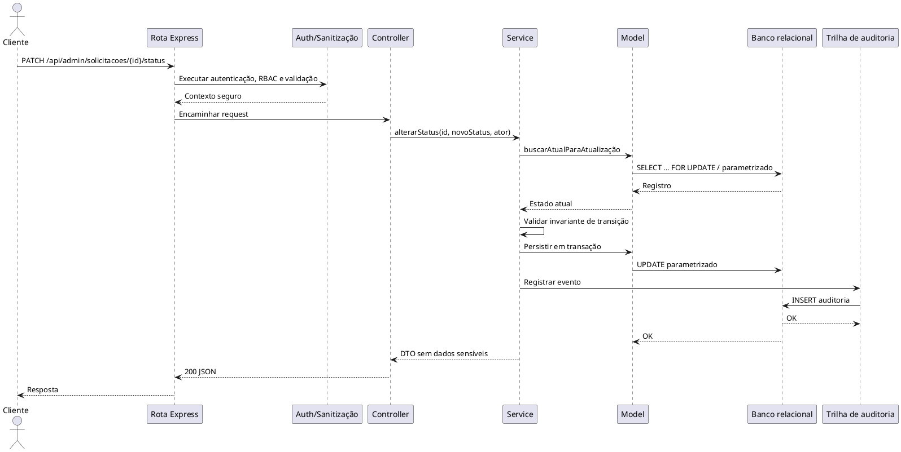

# Requisitos de Sistema

**Produto:** Turismo das Araras  
**Versão:** 1.0  
**Arquitetura-alvo:** HTML5/CSS3/JavaScript ES6+ + Node.js/Express + SQLite ou PostgreSQL

## 1. Premissas técnicas

A interface client-side apresenta o catálogo turístico e formulários. A API Node.js é a única camada autorizada a acessar o banco. SQLite atende uma implantação local de baixa concorrência; PostgreSQL é recomendado para operação multiusuário. Todo acesso a dados usa Prepared Statements, ORM ou Query Builder parametrizado. A API retorna JSON UTF-8 e utiliza UTC no armazenamento.

## 2. Requisitos Funcionais de Sistema (RSF)

### RSF-001 - Servir recursos públicos

O servidor deve servir HTML, CSS, JavaScript e imagens estáticas com `GET /`, `GET /inicio.html` e rotas de catálogo, aplicando `helmet`, compressão quando apropriado, cache de ativos versionados e tratamento de 404. O retorno esperado é `200 text/html` para recurso existente e `404 application/json` para API inexistente.

### RSF-002 - Listar atrativos

`GET /api/atrativos?busca=&categoria=&pagina=1&limite=20` deve retornar apenas `PUBLICADO`.

Resposta `200`:
```json
{"dados":[{"id":1,"slug":"serra-azul","nome":"Serra Azul","descricao":"...","categoria":"NATUREZA","status":"PUBLICADO"}],"paginacao":{"pagina":1,"limite":20,"total":1}}
```

Erros: `400` para parâmetros inválidos; `429` para excesso de requisições; `500` para falha inesperada.

### RSF-003 - Consultar atrativo

`GET /api/atrativos/{idOuSlug}` retorna `200` com o atrativo publicado, `400` para identificador inválido, `404` quando inexistente/não publicado e `500` em falha de infraestrutura.

### RSF-004 - Receber solicitação pública

`POST /api/solicitacoes` aceita:
```json
{"nome":"Ana Silva","email":"ana@example.com","telefone":"64999990000","mensagem":"Desejo informações sobre a trilha."}
```

O middleware `express.json({limit: "32kb"})`, `express-validator` e sanitização de saída devem ser aplicados. Respostas: `201` com `{id,status:"RECEBIDO"}`, `400` para validação, `413` para payload excessivo, `429` para abuso e `500` para falha controlada.

### RSF-005 - Cadastrar usuário

`POST /api/auth/register` aceita nome, e-mail e senha. Deve normalizar e-mail, verificar unicidade, aplicar hash Argon2id ou bcrypt com salt aleatório e nunca retornar hash. Respostas: `201`, `400`, `409` para e-mail existente, `429` e `500`.

### RSF-006 - Autenticar usuário

`POST /api/auth/login` aceita `{email,senha}`. Após comparação segura, retorna `200` com identidade mínima e JWT curto em cookie `HttpOnly; Secure; SameSite=Lax`, ou no corpo somente quando o cliente usar armazenamento protegido conforme política. Falha retorna `401` com mensagem genérica. `429` é aplicado após tentativas excedentes.

### RSF-007 - Encerrar sessão

`POST /api/auth/logout` invalida cookie, revoga refresh token quando houver, registra auditoria e retorna `204`. A API deve ser idempotente.

### RSF-008 - Manter atrativos

Rotas protegidas por `authenticateJwt` e `requireRole('ADMINISTRADOR')`:

- `POST /api/admin/atrativos`: cria e retorna `201`.
- `GET /api/admin/atrativos`: lista todos os status e retorna `200`.
- `GET /api/admin/atrativos/{id}`: detalha e retorna `200` ou `404`.
- `PATCH /api/admin/atrativos/{id}`: atualiza campos permitidos e retorna `200`.
- `DELETE /api/admin/atrativos/{id}`: exclusão lógica, auditoria e retorno `204`.

Erros comuns: `400` payload, `401` token ausente/inválido, `403` papel insuficiente, `404`, `409` conflito de versão e `500`.

### RSF-009 - Consultar solicitações administrativas

`GET /api/admin/solicitacoes?status=&desde=&ate=&pagina=&limite=` exige administrador/gestor autorizado. Retorna `200` com paginação, `400` com filtro inválido, `401/403`, `429` e `500`.

### RSF-010 - Alterar status

`PATCH /api/admin/solicitacoes/{id}/status` aceita:
```json
{"status":"EM_ATENDIMENTO","motivo":"Contato iniciado","versao":3}
```

Responde `200` com o recurso atualizado, `400` para status/motivo inválido, `401/403`, `404`, `409` para versão concorrente ou transição inválida e `500`. A atualização e a auditoria devem ocorrer na mesma transação.

### RSF-011 - Excluir registro

`DELETE /api/admin/registros/{id}` exige confirmação de interface em duas etapas, JWT válido, permissão e verificação de versão. O servidor não confia em um campo `confirmado` isolado como controle de segurança. Retorna `204`, `401`, `403`, `404`, `409` ou `500`.

### RSF-012 - Auditoria

`GET /api/admin/auditoria?entidade=&operacao=&desde=&ate=` retorna somente eventos autorizados. Cada evento deve conter ator, operação, entidade, identificador, data UTC, resultado e metadados não sensíveis. Senhas, tokens e dados completos de pagamento jamais entram na trilha.

## 3. Middlewares Express e ordem de execução

1. `helmet()` e política de segurança HTTP.
2. `cors` com lista explícita de origens, quando necessário.
3. `express.json` com limite de tamanho.
4. `requestId` e logger estruturado sem dados sensíveis.
5. `rateLimit` por rota e por identidade.
6. `express-validator`/normalização de payload.
7. `authenticateJwt` nas rotas protegidas.
8. `requireRole` e checagem de escopo.
9. Controller, Service e Repository.
10. Middleware final de erros, que converte exceções conhecidas em JSON uniforme.

Formato de erro:
```json
{"erro":{"codigo":"VALIDACAO_INVALIDA","mensagem":"Há campos inválidos.","detalhes":[{"campo":"email","regra":"email"}],"requestId":"..."}}
```

## 4. Requisitos Não Funcionais

### 4.1 Segurança

- **RSNF-S01:** Senhas devem usar Argon2id ou bcrypt com salt aleatório gerado pela biblioteca; parâmetros devem ser calibrados no ambiente, e a senha em texto puro deve existir somente durante a requisição.
- **RSNF-S02:** Autenticação deve ser stateless com JWT assinado, expiração curta, `iss`, `aud`, `sub`, `iat`, `exp` e papel mínimo. O token pode ser cookie HTTP-Only, Secure, SameSite, ou cabeçalho `Authorization: Bearer <token>`.
- **RSNF-S03:** Cookies exigem proteção CSRF. Nunca aceitar JWT de query string. Segredos vêm de `.env`/gerenciador de segredos e não do repositório.
- **RSNF-S04:** Toda entrada é validada por esquema, normalizada e sanitizada. Saída HTML usa escape contextual; conteúdo rico usa DOMPurify com allowlist restrita. CSP deve reduzir impacto de XSS.
- **RSNF-S05:** SQL usa placeholders/prepared statements ou camada parametrizada. A entrada não pode formar nomes de tabela, ordenação ou cláusulas sem allowlist.
- **RSNF-S06:** Rate limiting, lockout progressivo, logs de segurança, headers seguros, menor privilégio e mensagens de erro não reveladoras são obrigatórios.

### 4.2 Performance

- **RSNF-P01:** Operações de rede e banco usam APIs assíncronas; nenhuma consulta síncrona, criptografia pesada ou processamento grande pode bloquear o Event Loop.
- **RSNF-P02:** O pool PostgreSQL deve ter limite, timeout de conexão, timeout de consulta e liberação em `finally`. SQLite deve serializar escritas e ativar WAL quando compatível.
- **RSNF-P03:** Listagens usam paginação, índices e limite máximo de itens. Ativos estáticos usam cache e compressão adequada.
- **RSNF-P04:** Alvo de desempenho: p95 inferior a 500 ms para leitura simples sob carga nominal definida pelo plano de testes.

### 4.3 Confiabilidade

- **RSNF-R01:** Erros inesperados não encerram o processo sem supervisão; health check, graceful shutdown e reinício gerenciado devem existir.
- **RSNF-R02:** Mudanças de status e auditoria são atômicas. Transações têm rollback e idempotência quando aplicável.
- **RSNF-R03:** Backups do PostgreSQL e cópias consistentes do SQLite devem ser testados por restauração, não apenas gerados.

### 4.4 Usabilidade e acessibilidade

- **RSNF-U01:** Formulários têm labels, foco visível, mensagens associadas e suporte a teclado.
- **RSNF-U02:** A API fornece estados vazios, validação consistente e feedback que não depende apenas de cor ou Toast.
- **RSNF-U03:** HTML semântico e linguagem declarada em `pt-BR` devem ser mantidos nas novas telas.

### 4.5 Arquitetura e manutenibilidade

- **RSNF-A01:** Separar rotas, middlewares, controllers, services, repositories, modelos e migrações.
- **RSNF-A02:** Configuração validada na inicialização, com falha rápida para variáveis obrigatórias ausentes.
- **RSNF-A03:** Logs estruturados com `requestId`, testes automatizados e documentação de API versionada.

## 5. Sequência dinâmica de backend



## 6. Modelo de classes e invariantes OCL

```plantuml
@startuml
class Usuario {
  +id: UUID
  +nome: String
  +email: String
  +senhaHash: String
  +papel: Papel
  +ativo: Boolean
}
class Atrativo {
  +id: UUID
  +slug: String
  +nome: String
  +status: StatusAtrativo
}
class Solicitacao {
  +id: UUID
  +status: StatusAtendimento
  +versao: Integer
  +atualizarStatus()
}
class Auditoria { +id: UUID +operacao: String +criadoEm: DateTime }
class AtrativoController
class SolicitacaoController
class AuthMiddleware
class AtrativoService
class SolicitacaoService
Usuario "1" -- "0..*" Auditoria : gera
Usuario "0..1" -- "0..*" Solicitacao : cria
AtrativoController --> AtrativoService
SolicitacaoController --> SolicitacaoService
SolicitacaoController --> AuthMiddleware
AtrativoService --> Atrativo
SolicitacaoService --> Solicitacao
@enduml
```

### Invariantes OCL

```ocl
context Usuario
inv EmailNormalizado: self.email = self.email.toLowerCase()
inv SenhaNuncaEmTextoPuro: not self.senhaHash.includes(self.email)

context Solicitacao
inv VersaoPositiva: self.versao >= 1
inv MotivoEmEncerramento: self.status = StatusAtendimento::ENCERRADO implies self.motivo->notEmpty()

context Solicitacao::atualizarStatus(novo: StatusAtendimento)
pre EstadoConhecido: self.status <> null
pre TransicaoPermitida:
  (self.status = StatusAtendimento::RECEBIDO and novo = StatusAtendimento::EM_ATENDIMENTO) or
  (self.status = StatusAtendimento::EM_ATENDIMENTO and novo = StatusAtendimento::ENCERRADO) or
  (self.status = novo)
post VersaoIncrementada: self.versao = self.versao@pre + 1
post NovoEstado: self.status = novo
```

## 7. Dicionário técnico e DDL

### Entidades

| Tabela | Finalidade | Campos essenciais |
|---|---|---|
| `usuarios` | Identidade e autorização | id, nome, email, senha_hash, papel, ativo, criado_em |
| `atrativos` | Catálogo turístico | id, slug, nome, descricao, categoria, latitude, longitude, status |
| `solicitacoes` | Formulários públicos | id, nome, email, mensagem, status, versao, criado_em |
| `auditoria` | Rastreabilidade | id, usuario_id, operacao, entidade, entidade_id, dados, criado_em |
| `refresh_tokens` | Revogação opcional | id, usuario_id, hash_token, expira_em, revogado_em |

### DDL PostgreSQL

```sql
CREATE TABLE usuarios (
  id UUID PRIMARY KEY,
  nome VARCHAR(120) NOT NULL CHECK (char_length(trim(nome)) BETWEEN 2 AND 120),
  email VARCHAR(254) NOT NULL UNIQUE,
  senha_hash VARCHAR(255) NOT NULL,
  papel VARCHAR(20) NOT NULL DEFAULT 'USUARIO' CHECK (papel IN ('USUARIO','ADMINISTRADOR','GESTOR')),
  ativo BOOLEAN NOT NULL DEFAULT TRUE,
  criado_em TIMESTAMPTZ NOT NULL DEFAULT CURRENT_TIMESTAMP,
  atualizado_em TIMESTAMPTZ NOT NULL DEFAULT CURRENT_TIMESTAMP
);
CREATE UNIQUE INDEX ux_usuarios_email_normalizado ON usuarios (lower(email));

CREATE TABLE atrativos (
  id UUID PRIMARY KEY,
  slug VARCHAR(160) NOT NULL UNIQUE,
  nome VARCHAR(160) NOT NULL CHECK (char_length(trim(nome)) >= 2),
  descricao TEXT NOT NULL CHECK (char_length(descricao) <= 10000),
  categoria VARCHAR(40) NOT NULL,
  latitude NUMERIC(9,6), longitude NUMERIC(9,6),
  status VARCHAR(20) NOT NULL DEFAULT 'RASCUNHO' CHECK (status IN ('RASCUNHO','PUBLICADO','ARQUIVADO')),
  criado_por UUID REFERENCES usuarios(id),
  criado_em TIMESTAMPTZ NOT NULL DEFAULT CURRENT_TIMESTAMP,
  atualizado_em TIMESTAMPTZ NOT NULL DEFAULT CURRENT_TIMESTAMP
);
CREATE INDEX ix_atrativos_publicados_categoria ON atrativos (status, categoria, nome);

CREATE TABLE solicitacoes (
  id UUID PRIMARY KEY,
  nome VARCHAR(120) NOT NULL CHECK (char_length(trim(nome)) >= 2),
  email VARCHAR(254) NOT NULL,
  telefone VARCHAR(30),
  mensagem TEXT NOT NULL CHECK (char_length(trim(mensagem)) BETWEEN 1 AND 5000),
  status VARCHAR(24) NOT NULL DEFAULT 'RECEBIDO' CHECK (status IN ('RECEBIDO','EM_ATENDIMENTO','ENCERRADO','CANCELADO')),
  motivo TEXT,
  versao INTEGER NOT NULL DEFAULT 1 CHECK (versao >= 1),
  criado_em TIMESTAMPTZ NOT NULL DEFAULT CURRENT_TIMESTAMP,
  atualizado_em TIMESTAMPTZ NOT NULL DEFAULT CURRENT_TIMESTAMP
);
CREATE INDEX ix_solicitacoes_status_data ON solicitacoes (status, criado_em DESC);

CREATE TABLE auditoria (
  id BIGSERIAL PRIMARY KEY,
  usuario_id UUID REFERENCES usuarios(id),
  operacao VARCHAR(40) NOT NULL,
  entidade VARCHAR(60) NOT NULL,
  entidade_id UUID,
  resultado VARCHAR(20) NOT NULL CHECK (resultado IN ('SUCESSO','FALHA')),
  dados JSONB NOT NULL DEFAULT '{}'::jsonb,
  criado_em TIMESTAMPTZ NOT NULL DEFAULT CURRENT_TIMESTAMP
);
CREATE INDEX ix_auditoria_entidade_data ON auditoria (entidade, entidade_id, criado_em DESC);

CREATE TABLE refresh_tokens (
  id UUID PRIMARY KEY,
  usuario_id UUID NOT NULL REFERENCES usuarios(id) ON DELETE CASCADE,
  hash_token VARCHAR(255) NOT NULL UNIQUE,
  expira_em TIMESTAMPTZ NOT NULL,
  revogado_em TIMESTAMPTZ
);
```

Para SQLite, os UUIDs podem ser texto, `BOOLEAN` pode ser `INTEGER CHECK (ativo IN (0,1))`, `CURRENT_TIMESTAMP` permanece em UTC e as mesmas chaves, índices e verificações devem ser preservados.

## 8. Contratos REST

### Rotas públicas

| Método | Rota | Entrada | Sucesso | Falhas |
|---|---|---|---|---|
| GET | `/api/atrativos` | filtros/query | 200 | 400, 429, 500 |
| GET | `/api/atrativos/{idOuSlug}` | parâmetro | 200 | 400, 404, 500 |
| POST | `/api/solicitacoes` | JSON validado | 201 | 400, 413, 429, 500 |
| POST | `/api/auth/register` | JSON | 201 | 400, 409, 429, 500 |
| POST | `/api/auth/login` | JSON | 200 | 400, 401, 429, 500 |
| POST | `/api/auth/logout` | cookie/token | 204 | 401, 500 |
| GET | `/health` | nenhum | 200 | 503 |

### Rotas administrativas protegidas

| Método | Rota | Papel | Sucesso | Falhas |
|---|---|---|---|---|
| GET | `/api/admin/atrativos` | ADMINISTRADOR/GESTOR | 200 | 401, 403, 500 |
| POST | `/api/admin/atrativos` | ADMINISTRADOR | 201 | 400, 401, 403, 409 |
| PATCH | `/api/admin/atrativos/{id}` | ADMINISTRADOR | 200 | 400, 401, 403, 404, 409 |
| DELETE | `/api/admin/atrativos/{id}` | ADMINISTRADOR | 204 | 401, 403, 404, 409 |
| GET | `/api/admin/solicitacoes` | ADMINISTRADOR/GESTOR | 200 | 400, 401, 403, 500 |
| PATCH | `/api/admin/solicitacoes/{id}/status` | ADMINISTRADOR | 200 | 400, 401, 403, 404, 409 |
| DELETE | `/api/admin/registros/{id}` | ADMINISTRADOR | 204 | 401, 403, 404, 409 |
| GET | `/api/admin/auditoria` | ADMINISTRADOR/GESTOR | 200 | 400, 401, 403, 500 |

## 9. Matriz bidirecional de rastreabilidade técnica

| Requisito de usuário | RSF/RSNF | Componentes | Verificação |
|---|---|---|---|
| RU-001 | RSF-001 a RSF-003, RSNF-U01 | Rotas públicas, catálogo JS | Teste E2E de catálogo |
| RU-002 | RSF-002, RSNF-P03 | Query parametrizada, índice | Teste de filtros e carga |
| RU-003 | RSF-004, RSNF-S04 | Formulário, sanitizer, controller | Teste BDD e XSS |
| RU-004 | RSF-005, RSNF-S01 | Auth service, `usuarios` | Teste de hash e duplicidade |
| RU-005 | RSF-006/007, RSNF-S02 | JWT, middleware RBAC | Teste de token e expiração |
| RU-006 | RSF-008, RSNF-R02 | Atrativo service/repository | Teste CRUD e auditoria |
| RU-007 | RSF-009/010, RSNF-R02 | Status service, transação | Teste de matriz de transições |
| RU-008 | RSF-011/012, RSNF-S06 | Modal, autorização, auditoria | Teste de confirmação e concorrência |

A rastreabilidade inversa é obrigatória: todo RSF deve apontar para ao menos um RU ou requisito técnico; qualquer requisito sem caso de uso deve ser revisado antes da aprovação de escopo.
