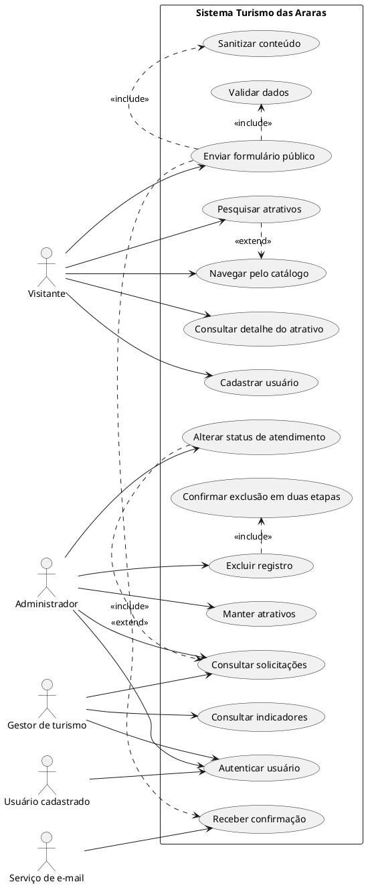
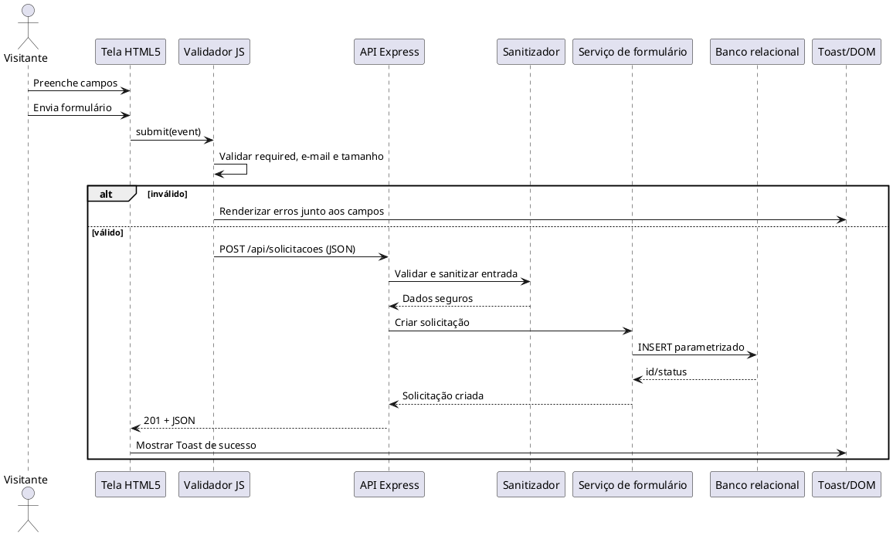
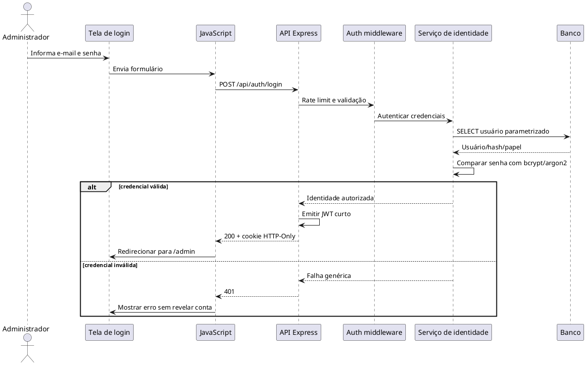
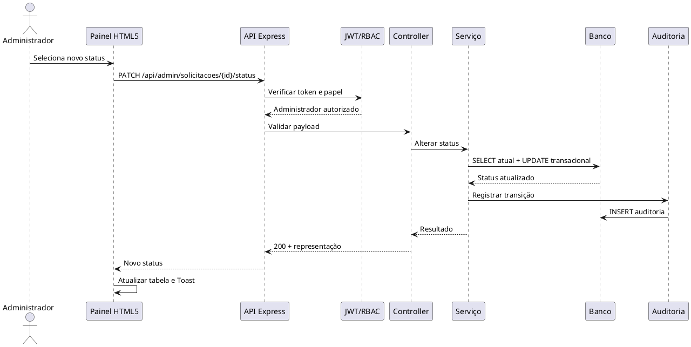
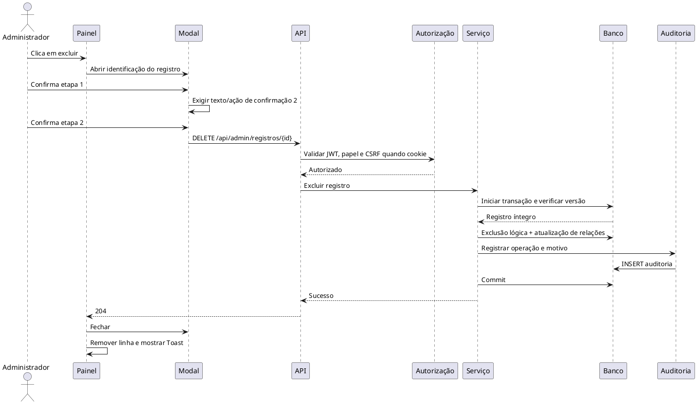

# Requisitos de Usuário

**Produto:** Turismo das Araras  
**Versão:** 1.0  
**Idioma:** Português Brasileiro  
**Referências:** UML 2.5.1, ISO/IEC/IEEE 29148:2018, FURPS+/ISO 25010

## 1. Objetivo e contexto

O sistema Turismo das Araras é um portal web para descoberta de atrativos turísticos, consulta de informações e operação administrativa de registros de atendimento. A experiência pública é realizada em HTML5 semântico, CSS3 e JavaScript ES6+. A solução-alvo prevê servidor Node.js com Express, persistência relacional e API REST protegida. As páginas atualmente existentes, como `index.html`, `inicio.html`, `login.html`, `cadrastro.html` e as páginas de atrativos, constituem o catálogo visual e o protótipo de navegação; os requisitos abaixo definem o comportamento de produto a ser implementado sem alterar esses arquivos como parte desta documentação.

## 2. Atores UML 2.5.1

Na UML, ator é um classificador externo que interage com o sistema por meio de casos de uso. Atores não são telas nem cargos internos do sistema.

| Ator | Classificação | Caracterização e responsabilidades |
|---|---|---|
| Visitante | Humano primário | Pessoa não autenticada que navega pelo catálogo, pesquisa atrativos, consulta detalhes e envia formulário público. |
| Usuário cadastrado | Humano primário | Visitante que possui conta válida e pode autenticar-se para utilizar recursos reservados. |
| Administrador | Humano primário | Operador autorizado que gerencia atrativos, usuários, solicitações e status de atendimento. |
| Gestor de turismo | Humano primário | Responsável por consultar indicadores e validar informações publicadas; possui permissões administrativas de leitura e aprovação. |
| Serviço de e-mail/notificação | Sistêmico secundário | Serviço externo que recebe solicitações de envio de confirmação ou alertas operacionais. |
| Provedor de identidade | Sistêmico secundário | Serviço opcional externo para autenticação federada; não é necessário para o fluxo local com JWT. |
| CDN de recursos | Sistêmico secundário | Origem externa opcional de bibliotecas ou fontes; não participa de regras de negócio. |
| Relógio do sistema | Sistêmico | Fonte de data/hora usada para expiração de sessão, auditoria e ordenação. |
| Banco relacional | Sistêmico | SQLite em implantação simples ou PostgreSQL em implantação concorrente; persiste dados por consultas parametrizadas. |
| Runtime Node.js | Sistêmico | Executa a API, gerencia I/O não bloqueante e hospeda os adaptadores da aplicação. |

### 2.1 Generalizações e limites

`Administrador` pode atuar como `Usuário cadastrado`, mas nem todo usuário cadastrado é administrador. O `Visitante` pode realizar os casos de uso públicos sem autenticação. Serviços externos não recebem privilégios de usuário; interagem somente pelas interfaces técnicas autorizadas.

## 3. Diagrama de casos de uso



## 4. Catálogo de requisitos de usuário

### RU-001 - Navegar e consultar catálogo

- **Caso de uso:** UC1, UC3
- **Ator principal:** Visitante
- **Prioridade:** Must
- **Pré-condições:** O portal está acessível; os recursos públicos e registros publicados estão disponíveis.
- **Fluxo operacional:** 1. O visitante acessa a página inicial. 2. O sistema apresenta navegação e atrativos publicados. 3. O visitante seleciona um atrativo. 4. O sistema exibe nome, descrição, localização, imagens e orientações. 5. O visitante retorna ao catálogo ou segue para outro detalhe.
- **Pós-condições:** A informação visualizada é registrada como evento analítico opcional; nenhum dado administrativo é alterado.
- **História:** Como visitante, quero consultar os atrativos para escolher um destino com informação confiável.
- **Aceite (Gherkin):**
```gherkin
Cenário: Abrir detalhe de atrativo publicado
Dado que existe um atrativo publicado
Quando o visitante seleciona o atrativo no catálogo
Então o sistema exibe seus dados completos sem exigir autenticação

Cenário: Ocultar atrativo não publicado
Dado que um atrativo está com status "RASCUNHO"
Quando o visitante consulta o catálogo
Então o atrativo não aparece na listagem pública
```

### RU-002 - Pesquisar atrativos

- **Caso de uso:** UC2
- **Ator principal:** Visitante
- **Prioridade:** Should
- **Pré-condições:** O catálogo foi carregado.
- **Fluxo operacional:** 1. O visitante informa termo, categoria ou região. 2. O sistema normaliza a entrada. 3. O sistema filtra somente itens publicados. 4. O sistema apresenta resultados ordenados e uma mensagem quando não houver correspondência.
- **Pós-condições:** O visitante consegue abrir um item resultante ou limpar os filtros.
- **História:** Como visitante, quero pesquisar por nome ou região para encontrar rapidamente um atrativo.
- **Aceite (Gherkin):**
```gherkin
Cenário: Encontrar atrativo por nome
Dado que há um atrativo publicado cujo nome contém "Serra"
Quando o visitante pesquisa "Serra"
Então o sistema exibe esse atrativo nos resultados

Cenário: Pesquisa sem resultado
Dado que não há atrativos publicados correspondentes ao termo
Quando o visitante pesquisa o termo
Então o sistema informa que nenhum resultado foi encontrado
```

### RU-003 - Enviar formulário público

- **Caso de uso:** UC4
- **Ator principal:** Visitante
- **Prioridade:** Must
- **Pré-condições:** O formulário está disponível; nome, e-mail e mensagem podem ser informados.
- **Fluxo operacional:** 1. O visitante preenche os campos. 2. O navegador executa validação client-side. 3. O sistema mostra erros junto aos campos inválidos. 4. Com dados válidos, o JavaScript envia requisição assíncrona. 5. O servidor valida e sanitiza novamente. 6. O sistema grava a solicitação e exibe Toast/feedback DOM. 7. Se habilitado, envia confirmação.
- **Pós-condições:** Uma solicitação válida fica registrada uma única vez com status `RECEBIDO`.
- **História:** Como visitante, quero enviar uma mensagem para solicitar orientação turística.
- **Aceite (Gherkin):**
```gherkin
Cenário: Envio válido
Dado que o visitante preenche nome, e-mail e mensagem válidos
Quando ele envia o formulário
Então o sistema grava a solicitação com status "RECEBIDO"
E exibe confirmação visual sem recarregar a página

Cenário: Campo inválido
Dado que o e-mail informado é inválido
Quando o visitante tenta enviar o formulário
Então o navegador sinaliza o campo
E não realiza a requisição

Cenário: Conteúdo potencialmente malicioso
Dado que a mensagem contém marcação HTML ou script
Quando o servidor recebe a solicitação
Então o conteúdo é sanitizado ou rejeitado
E nenhum script é executado ao ser exibido
```

### RU-004 - Cadastrar usuário

- **Caso de uso:** UC8
- **Ator principal:** Visitante
- **Prioridade:** Should
- **Pré-condições:** O e-mail ainda não está cadastrado; os campos obrigatórios foram preenchidos.
- **Fluxo operacional:** 1. O visitante informa nome, e-mail e senha. 2. O sistema valida confirmação da senha. 3. O backend verifica unicidade. 4. A senha é armazenada somente como hash. 5. O sistema informa sucesso e orienta o login.
- **Pós-condições:** A conta é criada com papel padrão `USUARIO` e status ativo.
- **História:** Como visitante, quero criar uma conta para acessar recursos autenticados.
- **Aceite (Gherkin):**
```gherkin
Cenário: Cadastro aprovado
Dado que o e-mail não existe e as senhas coincidem
Quando o visitante confirma o cadastro
Então a conta é criada sem armazenar a senha em texto puro

Cenário: E-mail duplicado
Dado que o e-mail já pertence a uma conta
Quando o visitante tenta cadastrar-se
Então o sistema rejeita a operação
E informa que o e-mail já está em uso
```

### RU-005 - Autenticar-se

- **Caso de uso:** UC9
- **Ator principal:** Usuário cadastrado ou Administrador
- **Prioridade:** Must
- **Pré-condições:** Existe conta ativa e credenciais válidas.
- **Fluxo operacional:** 1. O usuário informa credenciais. 2. O servidor compara o hash. 3. O servidor cria token/sessão com expiração. 4. O cliente armazena o token em cookie HTTP-Only ou utiliza o cabeçalho Bearer. 5. O sistema redireciona para a área permitida.
- **Pós-condições:** Há contexto autenticado e registro de auditoria de sucesso ou falha.
- **História:** Como administrador, quero entrar com segurança para operar registros.
- **Aceite (Gherkin):**
```gherkin
Cenário: Login administrativo válido
Dado que o administrador possui credenciais válidas
Quando ele envia o formulário de login
Então o sistema emite um token com papel administrativo
E redireciona para o painel

Cenário: Login inválido
Dado que a senha está incorreta
Quando o usuário tenta autenticar-se
Então o sistema responde com erro genérico
E não revela se o e-mail existe
```

### RU-006 - Manter atrativos

- **Caso de uso:** UC10
- **Ator principal:** Administrador
- **Prioridade:** Must
- **Pré-condições:** Administrador autenticado e autorizado.
- **Fluxo operacional:** 1. O administrador abre o painel. 2. Cria ou edita título, descrição, localização, imagens e status. 3. O sistema valida campos. 4. Persiste a alteração. 5. Registra autor, data e operação.
- **Pós-condições:** O atrativo fica em `RASCUNHO`, `PUBLICADO` ou `ARQUIVADO` conforme permissão.
- **História:** Como administrador, quero manter o catálogo para que as informações públicas permaneçam corretas.
- **Aceite (Gherkin):**
```gherkin
Cenário: Publicar atrativo válido
Dado que o administrador preenche todos os campos obrigatórios
Quando salva o atrativo com status "PUBLICADO"
Então o registro é persistido
E fica disponível na consulta pública
```

### RU-007 - Alterar status de atendimento

- **Caso de uso:** UC12
- **Ator principal:** Administrador
- **Prioridade:** Must
- **Pré-condições:** Administrador autenticado; solicitação existe; transição é permitida.
- **Fluxo operacional:** 1. O administrador abre uma solicitação. 2. Escolhe novo status. 3. O sistema verifica a transição válida. 4. Salva o status e a justificativa. 5. Atualiza a listagem e a trilha de auditoria.
- **Pós-condições:** O status vigente é exibido e a transição é rastreável.
- **História:** Como administrador, quero alterar o status para acompanhar o atendimento.
- **Aceite (Gherkin):**
```gherkin
Cenário: Recebido para em atendimento
Dado que a solicitação está em "RECEBIDO"
Quando o administrador seleciona "EM_ATENDIMENTO"
Então o sistema salva a transição
E registra operador e horário

Cenário: Transição inválida
Dado que a solicitação está em "ENCERRADO"
Quando o administrador tenta retorná-la para "RECEBIDO"
Então o sistema rejeita a operação
E mantém o status "ENCERRADO"
```

### RU-008 - Excluir registro com segurança

- **Caso de uso:** UC13
- **Ator principal:** Administrador
- **Prioridade:** Must
- **Pré-condições:** Administrador autenticado com permissão de exclusão; registro identificado.
- **Fluxo operacional:** 1. O administrador solicita exclusão. 2. O sistema abre modal com identificação do registro. 3. O administrador confirma a primeira etapa. 4. O sistema exige segunda confirmação explícita. 5. O backend verifica autorização, versão e integridade. 6. Executa exclusão lógica ou física conforme política. 7. Exibe resultado e audita a operação.
- **Pós-condições:** O registro deixa de aparecer para o público e a operação é auditável; referências protegidas não são quebradas.
- **História:** Como administrador, quero excluir registros com confirmação dupla para evitar remoções acidentais.
- **Aceite (Gherkin):**
```gherkin
Cenário: Exclusão confirmada em duas etapas
Dado que o administrador selecionou um registro
Quando confirma a primeira e a segunda etapa
Então o sistema exclui ou arquiva o registro
E registra a operação na auditoria

Cenário: Cancelamento
Dado que o modal de confirmação está aberto
Quando o administrador cancela
Então nenhum dado é alterado
```

## 5. Diagramas de sequência focados no usuário

### 5.1 Formulário HTML5, validação, sanitização e Toast



### 5.2 Login administrativo, token e redirecionamento



### 5.3 Alteração operacional de status



### 5.4 Exclusão segura em duas etapas



## 6. Regras de experiência e acessibilidade

1. Toda mensagem de erro deve identificar o campo, usar linguagem clara e permanecer disponível para tecnologias assistivas.
2. O foco deve ir para o primeiro erro após validação e retornar ao controle que abriu o modal quando ele for fechado.
3. Toasts não podem ser o único meio de comunicação; devem possuir região `aria-live` e texto persistente em falha.
4. O catálogo deve funcionar em teclado, telas pequenas e conexão lenta, sem depender de hover.
5. O cliente nunca deve assumir que a validação é suficiente: toda entrada também é validada no servidor.
6. Mensagens de autenticação não devem revelar existência de contas.

## 7. Critérios de pronto do produto

A entrega é considerada apta quando todos os requisitos Must possuem teste funcional, os fluxos de autenticação e exclusão possuem testes negativos, os diagramas são renderizáveis em PlantUML, e as operações administrativas deixam trilha de auditoria consultável por usuário autorizado.
